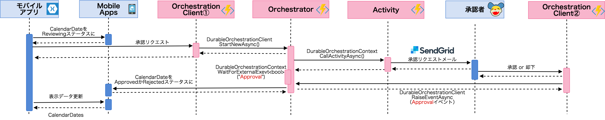
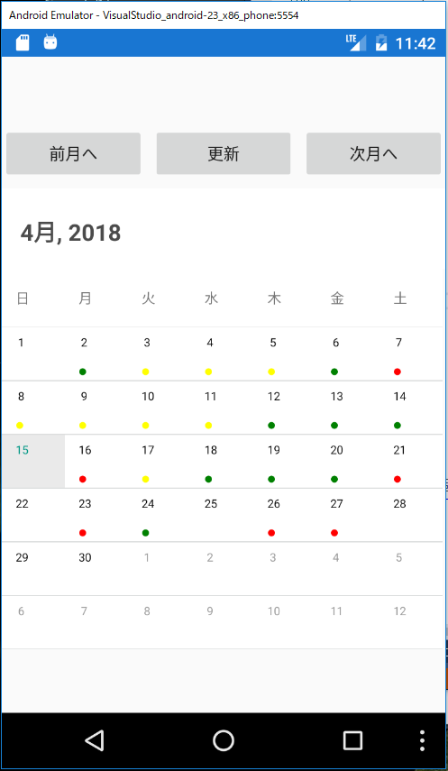
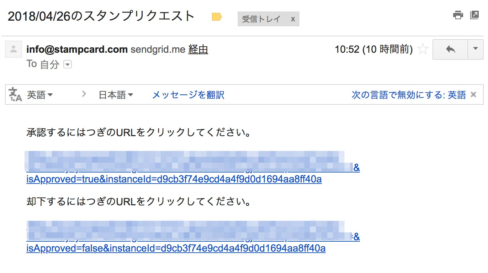

# 概要

スタンプカードアプリです。ただし、スタンプを押すためには承認者の承認が必須！

# アーキテクチャ

## モバイルクライアント
Xamarin.Forms

## バックエンド
Durable Fuctions

## シーケンス図

## アプリ

## スタンプリクエストメール

# LT資料
https://speakerdeck.com/toshi0607/serverless-mobile-backend-using-durable-functions-for-approval-flow

[Global Azure Bootcamp 2018@Tokyo](https://jazug.connpass.com/event/81865/)